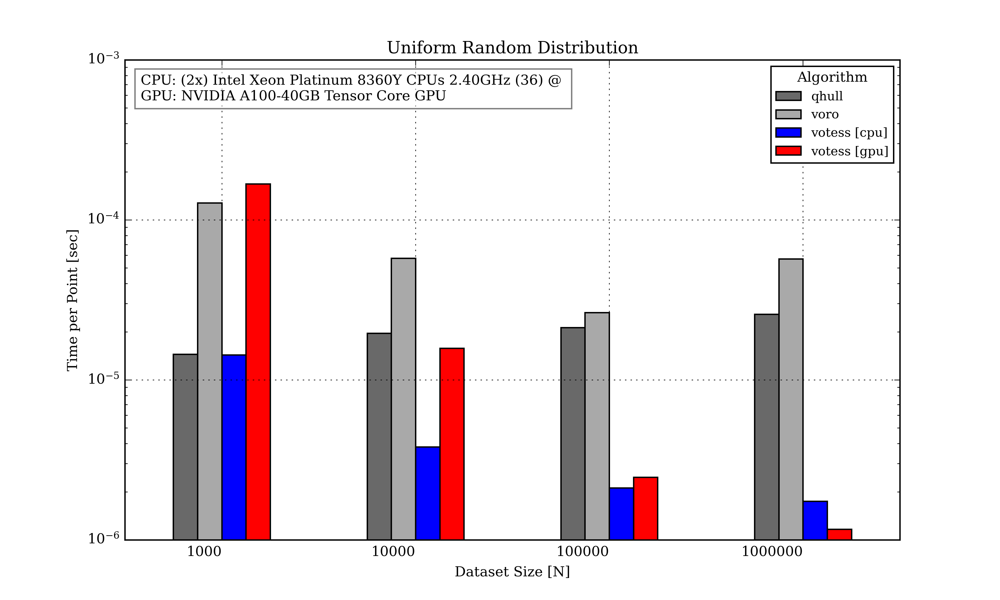

 
# Statement of need
 
The Voronoi tessellation is a spatial decomposition that uniquely partitions
space into convex sub-regions based on proximity to a discrete set of
generating points. It is widely used across scientific domains. In
astrophysics, Voronoi meshes are used in observational data analysis as well as
numerical simulations of cosmic structure formation [@Springel2010]. The
increasing size of modern datasets has underscored the need for faster, more
efficient algorithms and numerical methods. The rise of powerful many-core CPU
and GPU architectures has greatly increased the available computational power.
 
However, most existing implementations of Voronoi tessellations are tailored to
specific architectures, limiting their portability. Additionally, classic
sequential insertion algorithms have difficulty using multi-core systems in a
fully parallel manner. No general purpose, publicly available code capable of
GPU-accelerated parallel Voronoi mesh generation in 3D space is available.

# Summary

`votess` is a library for computing parallel 3D Voronoi tessellations on
heterogeneous platforms, from CPUs to GPUs to future accelerator architectures.
To do so, it uses the SYCL single-source framework abstraction. `votess` was
designed to be portable yet performant, accessible to both developers and users
with several easy-to-use interfaces.
 
The underlying algorithm computes the Voronoi mesh cell-by-cell [@ray2018]. It
produces the geometry of the Voronoi cells and their neighbor connectivity
information, rather than a full combinatorial mesh data structure. This
simplifies the method and makes it more ammenable to data parallel
architectures than alternatives such as sequential insertion or the
Bowyer-Watson algorithm.
 
The core method of `votess` consists of two main steps. First, the input set of
points is sorted into a grid, and a k-nearest neighbors search is performed.
Once the k nearest neighbors are identified for each point, the Voronoi cell is
computed by iteratively clipping a bounding box using the perpendicular
bisectors between the point and its nearby neighbors. A "security radius"
condition ensures that the resulting Voronoi cell is valid. If a cell cannot be
validated, an automatic CPU fallback mechanism ensures robustness.
 
This efficient algorithm allows for independent thread execution, making it
highly suitable for multi-core CPUs as well as GPU parallelism. This
independence of cell computations achieves significant speedups in parallel
environments.

## Performance

As expected, `votess` significantly outperforms single-threaded
alternatives.
 
In Figure 1, we show its performance compared to two other single-threaded
Voronoi tessellation libraries: `Qhull` and `Voro++`. Both are well-tested and
widely used. `Qhull` is a computational geometry library that constructs convex
hulls and Voronoi diagrams using an indirect projection method
[@10.1145/235815.235821], while `Voro++` is a C++ library specifically designed
for three-dimensional Voronoi tessellations, utilizing a cell-based computation
approach that is well-suited for physical applications [@rycroft2009voro].
 
We find that `votess` performs best on GPUs with large datasets. The CPU
implementation can outperform other implementations by a factor of 10 to 100.
 
Multithreaded Voronoi tesellelation codes do exist, and these include
`ParVoro++` [@WU2023102995], `CGAL` [@cgal2018], and `GEOGRAM` [@geogram2018].
However, they do not natively support GPU architectures.
 
# Features

`votess` is designed to be versatile. It supports various outputs, including
the natural neighbor information for each Voronoi cell. This is a 2D jagged
array of neighbor indices of the sorted input dataset.
 
Users can invoke `votess` in three ways: through the C++ library, a
command-line interface `clvotess`, and a Python wrapper interface `pyvotess`.
The C++ library offers a simple interface with a `tessellate` function that
computes the mesh. The Python wrapper, mirrors the functionality of the C++
version, with native numpy array support, providing ease of use for
Python-based workflows.
 
The behavior of `votess` can be fine-tuned with run time parameters in order to
(optionally) optimize runtime performance. 
 
# Acknowledgements

CB and DN acknowledge funding from the Deutsche Forschungsgemeinschaft (DFG)
through an Emmy Noether Research Group (grant number NE 2441/1-1).

# References

